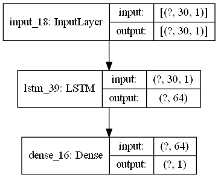

# Predicting COVID-19 Disease Incidence using Time Series Forecasting

The aim of this project is to design a deep learning model that is able to predict the number of new COVID-19 cases at a future point in time based on previous data.
The data used in this project was provided by the Malaysian Ministry of Health as part of an intiative to provide open data in the fight against COVID-19.

## Prerequisites

This script uses the following python libraries:
1. Pandas
2. Numpy
3. Scikit-Learn
4. TensorFlow
5. MatPlotLib

## Model Architecture
The following figure shows the default model architecture used in the script.

The training loss for this model as observed on TensorBoard can be seen in the figure below.

## Model Performance

## Credits

Data : [Open data on COVID-19 in Malaysia](https://github.com/MoH-Malaysia/covid19-public)
 
