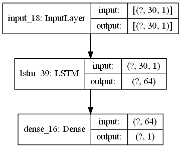
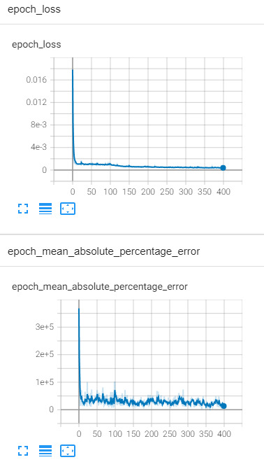
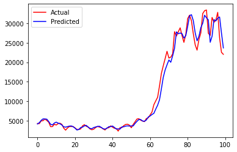

# Predicting COVID-19 Disease Incidence using Time Series Forecasting

The aim of this project is to design a deep learning model that is able to predict the number of new COVID-19 cases at a future point in time based on previous data.
The data used in this project was provided by the Malaysian Ministry of Health as part of an open data intiative in the fight against COVID-19.

## Prerequisites

This script uses the following python libraries:
1. Pandas
2. Numpy
3. Scikit-Learn
4. TensorFlow
5. MatPlotLib

## Model Architecture
The following figure shows the default model architecture used in the script.

The training loss for this model as observed on TensorBoard can be seen in the figure below.

The optimum number of epochs was determined to be 400 as there was no discernible improvement in model performance when the epochs value was increased.

## Results

The model was evaluated by visual comparison of predicted and actual number of cases.

The mean absolute percentage error (MAPE) for this model was calculated, with a value of 0.085 (8.5%).

For a forecasting model, an MAPE value of less than 10 % is considered satisfactory. However, the model performance might be improved further by increasing the amount of training data as the sample provided is small for the purpose of deep learning (n=680). 

## Credits

Data : [Open data on COVID-19 in Malaysia](https://github.com/MoH-Malaysia/covid19-public)

## References
1. [Measuring Forecasting Accuracy: Problems and Recommendations](https://www.researchgate.net/publication/282136084_Measuring_Forecasting_Accuracy_Problems_and_Recommendations_by_the_Example_of_SKU-Level_Judgmental_Adjustments)
2. [Forecasting FAQ s - Wiley Online Library](https://onlinelibrary.wiley.com/doi/pdf/10.1002/9781119199885.app1)

